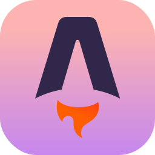
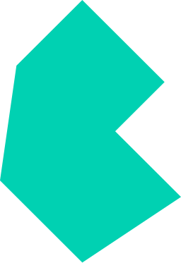
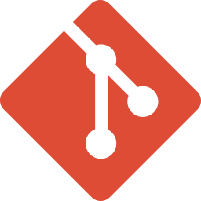
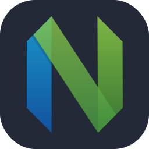
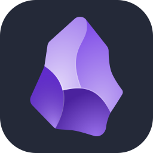

***Self-taught hobby developer with too many ideas and not enough time.***

I think a lot, work a lot, have existential crises, and know just enough about making websites to make me dangerous. I enjoy writing, reading, coding, listening to music, and love having a problem to solve.

With a background in engineering project management and a love for coding, I enjoy blending my technical knowledge with curiosity-driven side projects.

When I’m not working, you’ll find me learning new programming languages, experimenting with web development, or digging into the latest trends in public infrastructure.

Visit [MiguelPimentel.do](https://miguelpimentel.do/) to learn more [about me](https://miguelpimentel.do/about/), read my [blog](https://miguelpimentel.do/blog/), or to follow any of my [tutorials](https://miguelpimentel.do/tutorials/).

  
## Likes ❤️ Interests

## 📝 Blog Posts 🎓 Tutorials

<table>
<thead><tr><th>📅 Date</th><th>📝 Blog Posts</th></tr></thead>
<tbody>
<!-- BLOG-POST-LIST:START -->
<tr><th>Sep 12, 2024</th><td><a target='_blank' href='https://miguelpimentel.do/blog/2024-09-12-dr-fun-facts/'>10 Fun Facts About the Dominican Republic</a></td></tr>
<tr><th>Jul 27, 2023</th><td><a target='_blank' href='https://miguelpimentel.do/blog/2023-07-27-comparing-ssd-nvme/'>Comparing SSD and NVMe Technologies</a></td></tr>
<tr><th>Jul 11, 2023</th><td><a target='_blank' href='https://miguelpimentel.do/blog/2023-07-11-aurora-borealis/'>Aurora Borealis Pocket Guide</a></td></tr>
<tr><th>Jul 5, 2023</th><td><a target='_blank' href='https://miguelpimentel.do/blog/2023-07-05-on-burnout/'>Being a Firefighter Does Not Save You From Burnout</a></td></tr>
<tr><th>Jun 25, 2023</th><td><a target='_blank' href='https://miguelpimentel.do/blog/2023-06-25-unlock-firefox-sidebar/'>Tutorial: Unlock the Sidebar Width in Firefox</a></td></tr><!-- BLOG-POST-LIST:END -->
</tbody>
</table>

<table>
<thead><tr><th>📅 Date</th><th>🎓 Tutorials</th></tr></thead>
<tbody>
<!-- TUTORIALS:START -->
<tr><th>Jul 29, 2024</th><td><a target='_blank' href='https://miguelpimentel.do/tutorials/04-screenshot-website/'>Consistently Take a Website Screenshot</a></td></tr>
<tr><th>Jul 22, 2024</th><td><a target='_blank' href='https://miguelpimentel.do/tutorials/03-publish-logseq-github-pages/'>Publish a Logseq Graph to GitHub Pages</a></td></tr>
<tr><th>Jul 1, 2024</th><td><a target='_blank' href='https://miguelpimentel.do/tutorials/02-adding-prettier/'>Adding Prettier to Your Node Project</a></td></tr>
<tr><th>Jun 25, 2023</th><td><a target='_blank' href='https://miguelpimentel.do/tutorials/01-unlock-firefox-sidebar/'>Unlock the Sidebar Width in Firefox</a></td></tr><!-- TUTORIALS:END -->
</tbody>
</table>

## GitHub 📊 Stats

|  |
| :---: |

|  |
| :---: |

<!--
|  |
| :---: |
-->

|  |
| :---: |

|  |
| :---: |

<!--

-->

<!--

## Music 🎶 Artists

|  |
| --- |

-->

## Tools 🤖 Technologies

With 💜 from <a href="https://www.instagram.com/reel/BVRFeF8h2m3/" target="_blank">Minne</a><a href="https://www.instagram.com/reel/Bhl7n_oH1av/" target="_blank">sota</a>.

 

