**_Self-taught hobby developer with too many ideas and not enough time._** I love coding, collaborating, and solving problems. When I'm not working, you'll find me learning new programming languages or experimenting with web development.

Visit [MiguelPimentel.do](https://miguelpimentel.do/) to learn more about me, read my blog, or follow my tutorials.

  
## Skills & Interests ❤️🤖

## 📝 Blog Posts

<table>
<thead><tr><th>📅 Date</th><th>📝 Posts</th></tr></thead>
<tbody>
<!-- BLOG-POST-LIST:START -->
<tr><th>Aug 17, 2025</th><td><a target='_blank' href='https://miguelpimentel.do/blog/2025-08-17-pomobar-introduction/index.md'>PomoBar for Obsidian</a></td></tr>
<tr><th>Jul 31, 2025</th><td><a target='_blank' href='https://miguelpimentel.do/blog/2025-07-31-building-in-silence/index.md'>Building in Silence</a></td></tr>
<tr><th>Sep 12, 2024</th><td><a target='_blank' href='https://miguelpimentel.do/blog/2024-09-12-dominican-fun-facts/index.md'>10 Fun Facts About the Dominican Republic</a></td></tr>
<tr><th>Jul 27, 2023</th><td><a target='_blank' href='https://miguelpimentel.do/blog/2023-07-27-comparing-ssd-nvme/index.md'>Comparing SSD and NVMe Technologies</a></td></tr>
<tr><th>Jul 11, 2023</th><td><a target='_blank' href='https://miguelpimentel.do/blog/2023-07-11-aurora-borealis/index.md'>Aurora Borealis Reference Guide</a></td></tr><!-- BLOG-POST-LIST:END -->
</tbody>
</table>

## GitHub 📊 Stats

|  |
| :-----------------------------------------------------------------------: |

|  |
| :---------------------------------------------------------------------------------------: |

<!--
|  |
| :---: |
-->

|  |
| :---------------------------------------------------------------------------------------------------: |

 

## Music 🎶 Artists

|  |
| --------------------------------------------------------------------------------------------------------------------------------------------------------------- |

## Tools 🤖 Technologies

 

With 💜 from <a href="https://www.instagram.com/reel/BVRFeF8h2m3/" target="_blank">Minne</a><a href="https://www.instagram.com/reel/Bhl7n_oH1av/" target="_blank">sota</a>.

 

|  |
| --- |

