Self-taught hobby developer with too many ideas and not enough time.

## Likes ❤️ Interests

  

## GitHub 📊 Stats

## Musings ✍ Writings

| **📝 Blog Posts** | **📅 Date** |
| :------------- | :---: |
| [Being a Firefighter Does Not Save You From Burnout](https://miguelpimentel.do/on-burning-out/) | Jul 6, 2023 |
| [Blogging to Tame the Monkey Mind](https://miguelpimentel.do/monkey-mind/) | Apr 12, 2023 |
| [Hello World!](https://miguelpimentel.do/hello-world/) | Mar 18, 2023 |
| **📓 Notes** |  |
| [SSD / NVMe Comparison](https://miguelpimentel.do/ssd-nvme-comparison/) | Jul 28, 2023 |
| [Aurora Borealis Sighting](https://miguelpimentel.do/aurora-borealis/) | Jul 12, 2023 |
| **🎓 Tutorials** |  |
| [Unlock the Sidebar Width in Firefox](https://miguelpimentel.do/unlock-firefox-sidebar/) | Jun 26, 2023 |

<!-- ## 📝 Blog Posts -->

<!-- BLOG-POST-LIST:START -->
- Jul 6, 2023 · [Being a Firefighter Does Not Save You From Burnout](https://miguelpimentel.do/on-burning-out/)
- Apr 12, 2023 · [Blogging to Tame the Monkey Mind](https://miguelpimentel.do/monkey-mind/)
- Mar 18, 2023 · [Hello World!](https://miguelpimentel.do/hello-world/)<!-- BLOG-POST-LIST:END -->

<!-- ## 📓 Notes -->

<!-- NOTES:START -->
<!-- - Jul 28, 2023 · [SSD / NVMe Comparison](https://miguelpimentel.do/ssd-nvme-comparison/)
- Jul 12, 2023 · [Aurora Borealis Sighting](https://miguelpimentel.do/aurora-borealis/) -->
<!-- NOTES:END -->

<!-- ## 🎓 Tutorials -->

<!-- TUTORIALS:START -->
<!-- - Jun 26, 2023 · [Unlock the Sidebar Width in Firefox](https://miguelpimentel.do/unlock-firefox-sidebar/) -->
<!-- TUTORIALS:END -->

<!-- ## 🕒 Recent Activity -->

<!--START_SECTION:activity-->
<!-- 1. 🗣 Commented on [#2](https://github.com/kjk/edna/issues/2#issuecomment-2138026500) in [kjk/edna](https://github.com/kjk/edna)
1. ❗ Opened issue [#2](https://github.com/kjk/edna/issues/2) in [kjk/edna](https://github.com/kjk/edna)
2. ❌ Closed PR [#4](https://github.com/semanticdata/eleventy-plus-vite/pull/4) in [semanticdata/eleventy-plus-vite](https://github.com/semanticdata/eleventy-plus-vite) -->
<!--END_SECTION:activity-->

<!--  -->

<!--  -->

<!--  -->

## Music 🎶 Spotify

## Tools 🤖 Technologies

                     

<!--  -->

---
With 💜 from <a href="https://www.instagram.com/reel/BVRFeF8h2m3/" target="_blank">Minne</a><a href="https://www.instagram.com/reel/Bhl7n_oH1av/" target="_blank">sota</a>.

 

