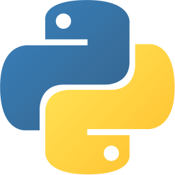

# Hi, I'm Miguel 👋

<!--  -->

📍 **Minnesota, US** | 🚧 **Public Infrastructure Professional** | 🧑🏻‍💻 **Self-taught hobby developer**

_Self-taught hobby developer with too many ideas and not enough time._

I love coding, collaborating, and solving problems. When I'm not working, you'll find me learning new programming languages or experimenting with web development.

🌐 [MiguelPimentel.do](https://miguelpimentel.do/) | 💖 [database.omg.lol](https://database.omg.lol/) | 🌿 [ForgetfulNotes.com](https://github.com/semanticdata/forgetful-notes)

## Current Projects

- ℹ️ [Influx](https://github.com/jensmtg/influx) - Transform Obsidian backlinks into excerpts (maintainer)
- 🍅 [PomoBar](https://github.com/semanticdata/obsidian-pomodoro) - Minimalist Pomodoro timer that lives in your Obsidian status bar
- 🎵 [Crucial Tracks Now](https://source.tube/database/crucial-tracks-now) - JavaScript widget to display your latest Crucial Tracks on your website
- 🎵 [Libre.fm Now](https://source.tube/database/libre-fm-now) - JavaScript widget to display your latest Libre.fm scrobbles on your website
- 📝 [NoteKeeper](https://github.com/semanticdata/notekeeper) - Firefox extension that transforms the New Tab into a minimalist, auto-saving text editor
- 🔖 [New Tab Bookmarks](https://github.com/semanticdata/new-tab-bookmarks) - New tab replacement for your browser focused on your bookmarks bar
- 🔮 [Obsidian Starter](https://github.com/semanticdata/obsidian-starter-vault) - Opinionated, pre-configured Obsidian starter vault
- 📊 [StatBar](https://github.com/semanticdata/obsidian-statbar) - Minimalist Obsidian status bar note stats
- 🦎 [Mabuya](https://github.com/semanticdata/mabuya) - Lightweight Zola theme for creating fast, SEO-optimized blogs
- 📚 [Zola Minimal](https://github.com/semanticdata/zola-minimal) - Zola port of the Jekyll theme with the same name
- 🗒️ [PastePad](https://github.com/semanticdata/pastepad) - VS Code extension to manage your paste.lol pastebin

## Archived Projects

- 🚦 [Traffic Studies](https://github.com/semanticdata/traffic-studies) - Comprehensive traffic analysis dashboard for Crystal, Minnesota
- 💦 [Adopt-a-Drain](https://github.com/semanticdata/adopt-a-drain) - Dashboard for the Adopt-a-Drain program in Crystal, Minnesota

## Latest Blog Posts

<!-- BLOG-POST-LIST:START -->
- <a target='_blank' href='https://miguelpimentel.do/blog/2025-12-23-adopt-a-drain-introduction/'>The Adopt-a-Drain Dashboard</a>
- <a target='_blank' href='https://miguelpimentel.do/blog/2025-12-17-adding-snow-fall-with-is-land/'>Adding Snow, Keeping Warm: Using &lt;is-land&gt; Responsibly</a>
- <a target='_blank' href='https://miguelpimentel.do/blog/2025-12-11-solving-blinking-view-transitions/'>Solving Blinking View Transitions &lpar;Featured on Piccalilli&rpar;</a>
- <a target='_blank' href='https://miguelpimentel.do/blog/2025-12-09-when-gratitude-rings/'>When Gratitude Rings</a>
- <a target='_blank' href='https://miguelpimentel.do/blog/2025-12-07-vscode-regex/'>VS Code Regex: Conditional Find and Replace</a>
- <a target='_blank' href='https://miguelpimentel.do/blog/2025-09-15-when-being-wrong-goes-right/'>When Being Wrong Goes Right</a>
- <a target='_blank' href='https://miguelpimentel.do/blog/2025-09-09-actual-problem-solving-rituals/'>My Actual Problem-Solving Rituals</a>
- <a target='_blank' href='https://miguelpimentel.do/blog/2025-08-17-pomobar-introduction/'>PomoBar for Obsidian</a>
- <a target='_blank' href='https://miguelpimentel.do/blog/2025-07-31-building-in-silence/'>Building in Silence</a>
- <a target='_blank' href='https://miguelpimentel.do/blog/2024-09-12-dominican-fun-facts/'>10 Fun Facts About the Dominican Republic</a><!-- BLOG-POST-LIST:END -->

### 📌 Pinned

- [Why are my view transitions blinking?](https://piccalil.li/blog/why-are-my-view-transitions-blinking/)
- [Being a Firefighter Does Not Save You From Burnout](https://miguelpimentel.do/blog/2023-07-05-on-burnout/)

## GitHub Stats

## 🛠️ Technologies

## 🎵 Music Vibes

## What I'm Doing

- **Building in public** - Sharing my learning journey through blog posts and tutorials
- **Experimenting with modern web tech** - Always trying new frameworks and tools
- **Contributing to open source** - When I find projects that align with my interests
- **Learning continuously** - Always exploring new programming languages and paradigms

## Connect

<!--  -->

With 💜 from <a href="https://www.instagram.com/reel/BVRFeF8h2m3/" target="_blank">Minne</a><a href="https://www.instagram.com/reel/Bhl7n_oH1av/" target="_blank">sota</a>.

 

